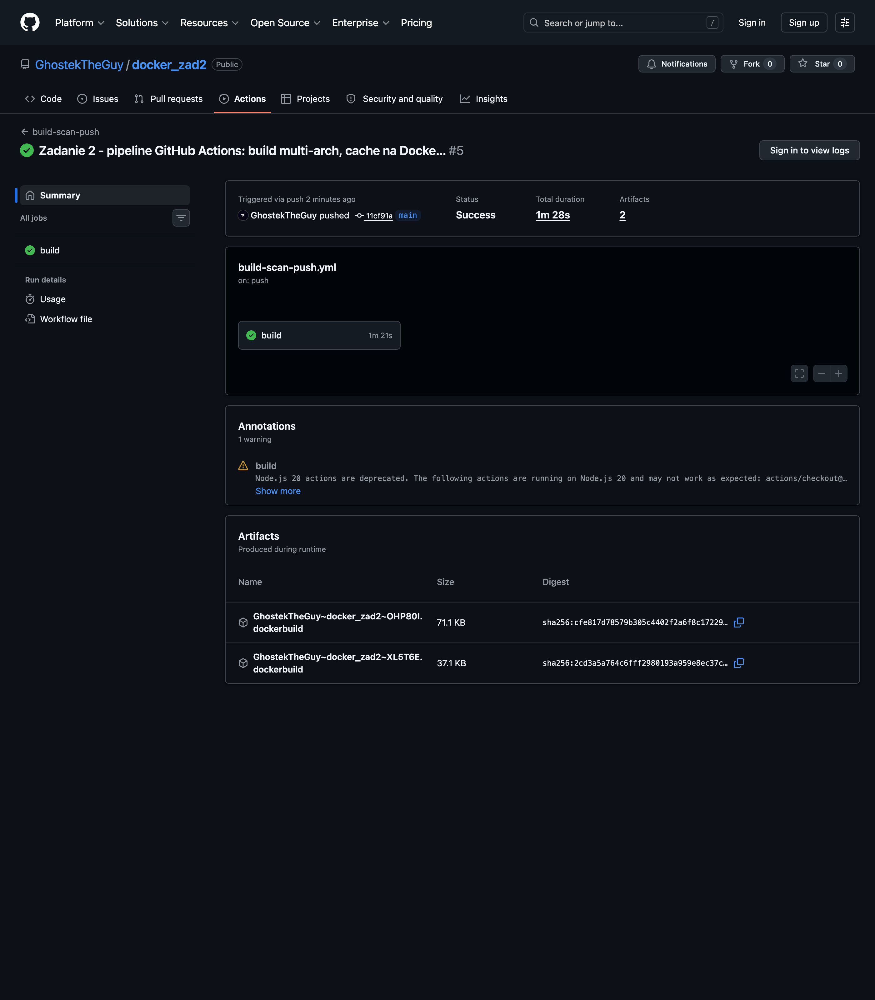
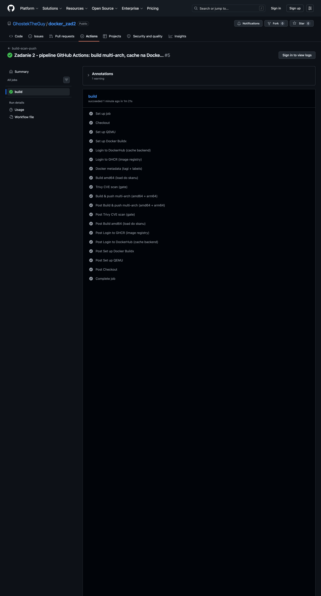
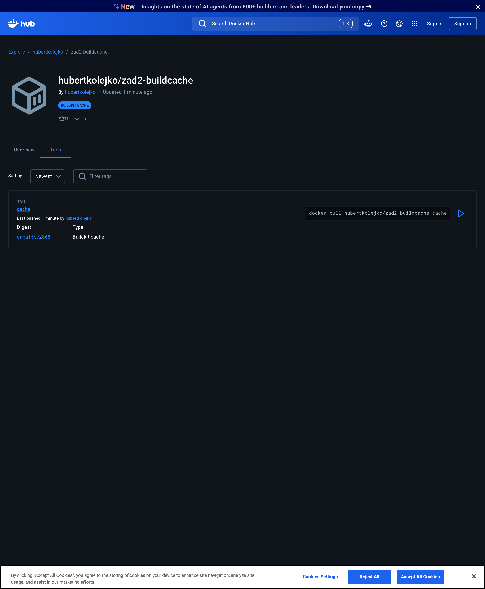
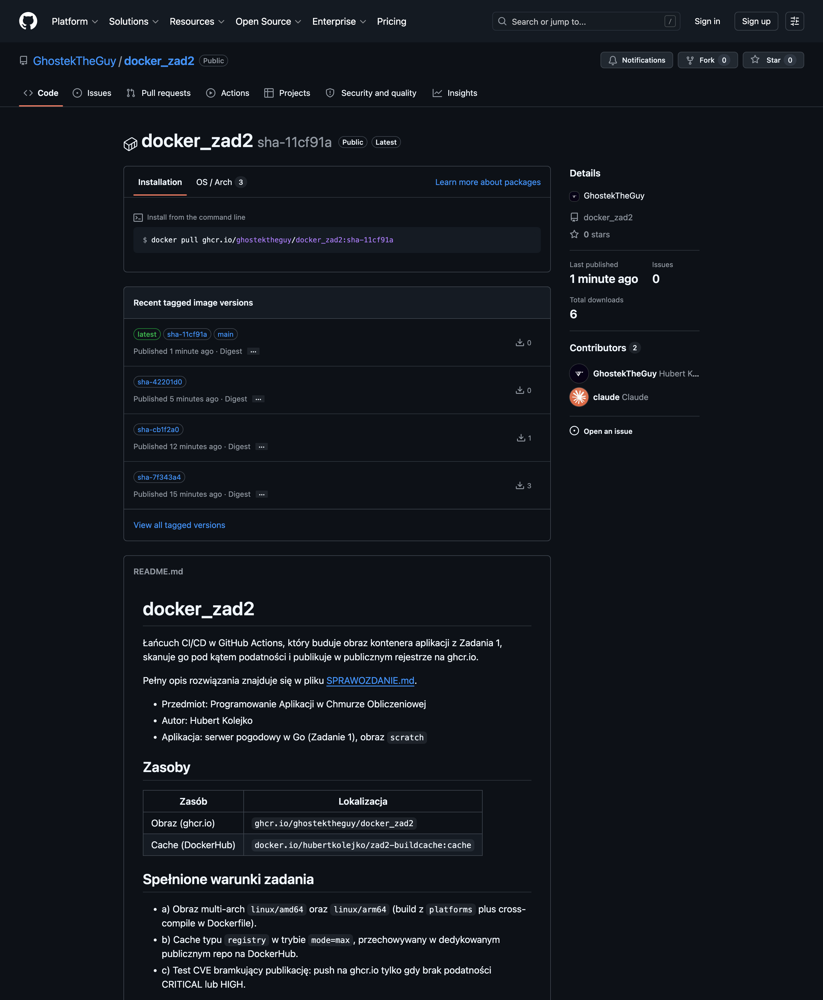

# Sprawozdanie - Zadanie 2

**Przedmiot:** Programowanie Aplikacji w Chmurze Obliczeniowej
**Autor:** Hubert Kolejko
**Repozytorium:** https://github.com/GhostekTheGuy/docker_zad2

## 1. Cel zadania

Opracowanie łańcucha (pipeline) w GitHub Actions, który buduje obraz kontenera aplikacji z Zadania 1
i publikuje go w publicznym repozytorium obrazów na ghcr.io. Łańcuch ma dodatkowo spełniać trzy warunki:

* a) obraz wspiera dwie architektury: `linux/amd64` oraz `linux/arm64`,
* b) wykorzystuje dane cache (eksporter `registry`, backend `registry`, tryb `max`) przechowywane
  w dedykowanym, publicznym repozytorium na DockerHub,
* c) wykonuje test CVE i publikuje obraz na ghcr.io tylko wtedy, gdy obraz nie zawiera podatności
  sklasyfikowanych jako CRITICAL lub HIGH.

## 2. Aplikacja

Aplikacją jest serwer pogodowy z Zadania 1 napisany w czystym Go (tylko biblioteka standardowa).
Serwuje formularz HTML do wyboru kraju i miasta, a po wyborze pobiera bieżące dane pogodowe z API
Open-Meteo. Brak zależności zewnętrznych pozwala zbudować statyczną binarkę i umieścić ją w obrazie
`scratch`. Aplikacja udostępnia endpoint `/health` używany przez `HEALTHCHECK` (binarka z flagą
`-healthcheck`). Pliki: `cmd/server/main.go`, `go.mod`.

## 3. Dockerfile

Obraz budowany jest dwuetapowo (multi-stage):

1. Etap `builder` na bazie `golang:1.26-alpine`, uruchamiany z `--platform=$BUILDPLATFORM`.
   BuildKit wstrzykuje `TARGETOS` i `TARGETARCH`, dzięki czemu kompilacja jest skrośna
   (`CGO_ENABLED=0 GOOS=$TARGETOS GOARCH=$TARGETARCH`). To kluczowe dla budowy multi-arch:
   warstwa arm64 powstaje przez cross-compile, a nie przez wolną emulację całego buildu.
   Mountowany cache BuildKit (`--mount=type=cache`) przyspiesza pobieranie modułów i kompilację.
2. Etap finalny na bazie `scratch`. Kopiowane są tylko certyfikaty CA (potrzebne do HTTPS wobec
   Open-Meteo) oraz binarka. Ustawiony jest użytkownik nieuprzywilejowany `65534:65534`, etykiety
   OCI oraz `HEALTHCHECK` wywołujący binarkę z flagą `-healthcheck`.

Plik: `Dockerfile`.

## 4. Łańcuch GitHub Actions

Plik: `.github/workflows/build-scan-push.yml`. Cały proces to jeden job na `ubuntu-latest`,
wyzwalany przez push na `main`, tag `v*.*.*` oraz ręcznie (`workflow_dispatch`).

### 4.1 Problem projektowy i jego rozwiązanie

Warunek (c) wymaga skanu obrazu przed publikacją, a skaner pracuje na obrazie obecnym w lokalnym
demonie Docker. Obrazu multi-arch (warunek a) nie da się załadować do pojedynczego demona przez
`--load`, bo demon trzyma obraz jednej architektury. Rozwiązanie polega na rozbiciu budowy na dwa
przebiegi:

1. Build tylko `linux/amd64` z `load: true`. Obraz trafia do demona pod tagiem `:scan`
   i jednocześnie zapełnia cache na DockerHub.
2. Skan Trivy obrazu `:scan`. Wykrycie podatności CRITICAL lub HIGH kończy krok kodem różnym od zera,
   co przerywa job. Następne kroki się nie wykonują, więc publikacja nie następuje.
3. Build `linux/amd64,linux/arm64` z `push: true`. Wykonuje się tylko po przejściu skanu.
   Dzięki `cache-from` korzysta z warstw zapełnionych w kroku 1, więc warstwa amd64 jest pobierana
   z cache, a realnie kompilowana jest tylko warstwa arm64.

Skan na amd64 jest wystarczający, bo obraz to `scratch` plus statyczna binarka Go, bez pakietów
systemowych, więc zbiór podatności jest praktycznie identyczny dla obu architektur.

### 4.2 Kolejne kroki workflow

1. `actions/checkout` - pobranie kodu.
2. `docker/setup-qemu-action` - rejestracja emulacji QEMU dla arm64.
3. `docker/setup-buildx-action` - Buildx z driverem `docker-container`, wymagany do multi-arch
   i eksportera cache typu `registry`.
4. `docker/login-action` (DockerHub) - logowanie potrzebne do zapisu i odczytu cache.
   Sekrety `DOCKERHUB_USERNAME`, `DOCKERHUB_TOKEN`.
5. `docker/login-action` (ghcr.io) - logowanie do docelowego rejestru, wbudowanym `GITHUB_TOKEN`
   (uprawnienie `packages: write`).
6. `docker/metadata-action` - generowanie tagów i etykiet OCI (rozdział 5).
7. Build amd64 z `load: true`, `cache-to type=registry,...,mode=max`.
8. `aquasecurity/trivy-action` - bramka CVE (`severity: CRITICAL,HIGH`, `exit-code: 1`).
9. Build multi-arch z `push: true`, te same parametry cache.

## 5. Schemat tagowania

### 5.1 Obraz (ghcr.io)

Tagi generuje `docker/metadata-action`:

| Tag | Kiedy powstaje | Rola |
|-----|----------------|------|
| `latest` | tylko gałąź domyślna `main` | ruchomy wskaźnik na najnowsze wydanie |
| `sha-<short-sha>` | każdy build | niezmienny, wiąże obraz z konkretnym commitem |
| `<branch>` | build z gałęzi | obraz rozwojowy danej gałęzi |
| `X.Y.Z`, `X.Y` | push tagu git `vX.Y.Z` | wydania według SemVer |

### 5.2 Cache (DockerHub)

Jeden stały tag: `hubertkolejko/zad2-buildcache:cache`. Eksporter `registry`, tryb `mode=max`.

### 5.3 Uzasadnienie

Tag `latest` jest mutowalny i sam w sobie nie informuje, jaki kod zawiera obraz, co utrudnia
reprodukowalność i rollback. Dlatego głównym identyfikatorem jest niezmienny `sha-<commit>`
jednoznacznie powiązany ze stanem repozytorium, a wydania oznaczane są według SemVer. `latest`
pozostaje wyłącznie wygodnym aliasem najnowszego stanu gałęzi `main`. Jest to zgodne z zaleceniami
dokumentacji Dockera dotyczącymi tagowania oraz z adnotacjami obrazu w specyfikacji OCI
(`org.opencontainers.image.revision`, `org.opencontainers.image.version`), które metadata-action
ustawia automatycznie.

Cache trzymany jest w osobnym repozytorium, oddzielnie od repozytorium obrazów aplikacji, żeby nie
mieszać artefaktów pomocniczych z wydaniami. Runnery GitHub Actions są efemeryczne i nie mają
trwałego lokalnego cache między uruchomieniami, więc cache musi być zewnętrzny. Backend `registry`
jest do tego zalecany w dokumentacji Buildx, a tryb `mode=max` eksportuje również warstwy etapów
pośrednich (etap `builder`), nie tylko finalne, co daje wyższy współczynnik trafień przy budowie
multi-stage.

Źródła:

* Docker Docs, Build cache - Cache backends (registry, parametr `mode=max`).
* Docker Docs, dobre praktyki tagowania obrazów.
* OCI Image Spec, annotations.

## 6. Wybór skanera CVE: Trivy

Wybrano Trivy (`aquasecurity/trivy-action`). Dla tego testu jest najprostszy:

* parametr `exit-code: 1` w połączeniu z `severity: CRITICAL,HIGH` realizuje bramkę wprost, bez
  dodatkowej logiki w workflow (kod wyjścia różny od zera przerywa job, więc push się nie wykonuje),
* nie wymaga logowania do konta Docker ani subskrypcji, w odróżnieniu od Docker Scout,
* skanuje obraz obecny w lokalnym demonie (`image-ref`), co pasuje do schematu z rozdziału 4.1.

Dodatkowo ustawiono `ignore-unfixed: true`, żeby podatności bez dostępnej poprawki nie blokowały
publikacji (i tak nie da się ich usunąć aktualizacją). W praktyce obraz oparty o `scratch` nie
zawiera pakietów systemowych, więc skan kończy się wynikiem czystym.

## 7. Konfiguracja

Sekrety repozytorium (Settings, Secrets and variables, Actions):

| Sekret | Wartość |
|--------|---------|
| `DOCKERHUB_USERNAME` | `hubertkolejko` |
| `DOCKERHUB_TOKEN` | Personal Access Token z DockerHub, uprawnienie Read & Write |

`GITHUB_TOKEN` jest dostarczany automatycznie. Repozytorium cache na DockerHub
(`hubertkolejko/zad2-buildcache`) oraz pakiet na ghcr.io (`docker_zad2`) są publiczne.

## 8. Wynik uruchomienia

Łańcuch uruchomiono i zakończył się powodzeniem. Przebieg:
https://github.com/GhostekTheGuy/docker_zad2/actions/runs/26665158416

### 8.1 Podsumowanie przebiegu

Status Success, czas wykonania jobu około 1 min 17 s.



### 8.2 Kroki jobu

Wszystkie kroki zakończone powodzeniem, w tym bramka CVE Trivy oraz build i push multi-arch.



### 8.3 Wynik testu CVE

Trivy zakończył się wynikiem czystym dla progu CRITICAL,HIGH, więc publikacja została dopuszczona:

```text
INPUT_SEVERITY: CRITICAL,HIGH
Report Summary
'0': Clean (no security findings detected)
```

### 8.4 Cache na DockerHub

Repozytorium `hubertkolejko/zad2-buildcache` jest publiczne i zawiera tag `cache` typu Buildkit cache.
W logu drugiego buildu widać import cache i trafienia (`CACHED`):

```text
#8 importing cache manifest from docker.io/***/zad2-buildcache:cache
#9 [linux/amd64 builder 2/6] WORKDIR /src
#9 CACHED
#10 [linux/amd64 builder 4/6] RUN ... go mod download
#10 CACHED
#11 [linux/amd64 builder 6/6] RUN ... go build ...
#11 CACHED
```



### 8.5 Obraz multi-arch na ghcr.io

Pakiet `ghcr.io/ghostektheguy/docker_zad2` jest publiczny. Manifest `latest` zawiera warianty
`linux/amd64` oraz `linux/arm64` (pełny wynik w `docs/multiarch-inspect.txt`):

```text
$ docker buildx imagetools inspect ghcr.io/ghostektheguy/docker_zad2:latest
MediaType: application/vnd.oci.image.index.v1+json
Manifests:
  ... Platform: linux/amd64
  ... Platform: linux/arm64
```



### 8.6 Działanie aplikacji z opublikowanego obrazu

```text
$ docker run --rm -p 8080:8080 ghcr.io/ghostektheguy/docker_zad2:latest
$ curl localhost:8080/health
ok
```

## 9. Spełnienie warunków zadania

| Warunek | Realizacja | Dowód |
|---------|------------|-------|
| a) multi-arch amd64 + arm64 | build z `platforms: linux/amd64,linux/arm64`, cross-compile w Dockerfile | rozdz. 8.5, `docs/multiarch-inspect.txt` |
| b) cache registry mode=max na DockerHub | `cache-to/from type=registry,ref=...zad2-buildcache:cache,mode=max`, repo publiczne | rozdz. 8.4 |
| c) test CVE jako bramka publikacji | Trivy `severity: CRITICAL,HIGH`, `exit-code: 1`, push tylko po przejściu | rozdz. 8.3, 8.2 |
